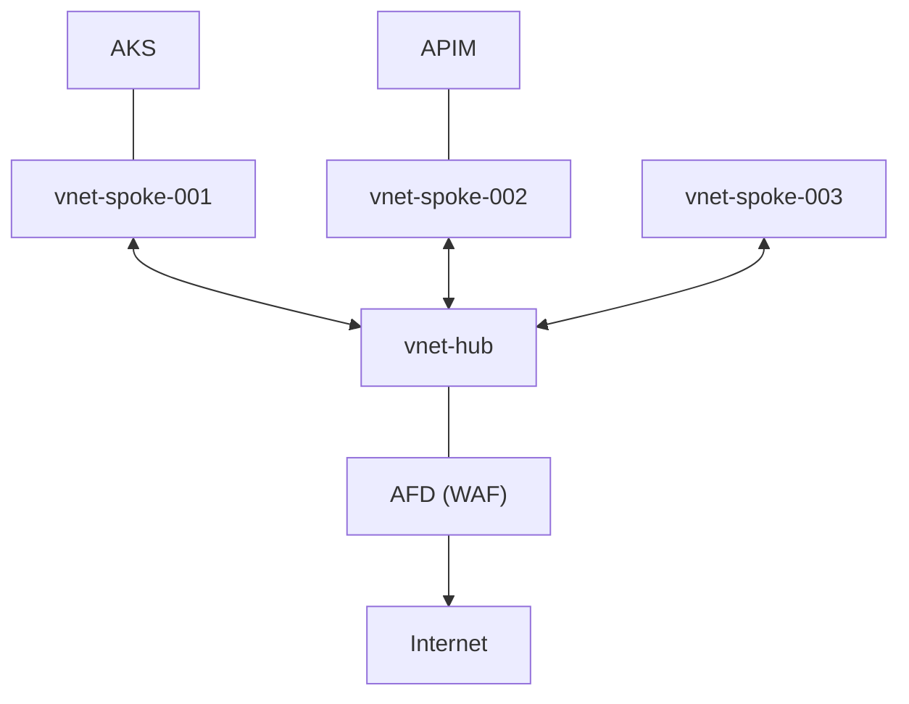

```mermaid
graph TD;
    A[AKS]
    B[APIM]
    C[vnet-spoke-001]
    D[vnet-spoke-002]
    E[vnet-spoke-003]
    F[vnet-hub]
    G["AFD (WAF)"]
    H[Internet]

    
    A --- C
    B --- D
    C <--> F
    D <--> F
    E <--> F --- G
    G --> H
```
